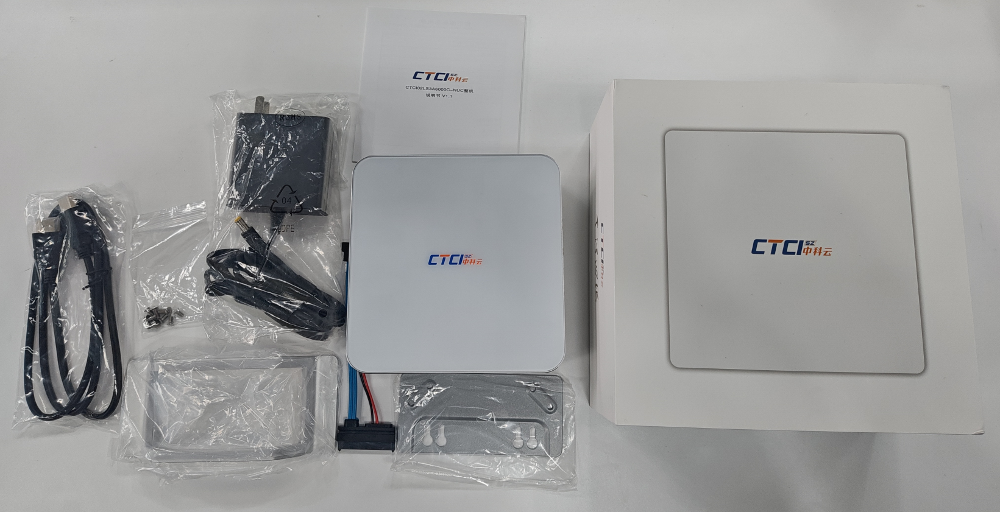
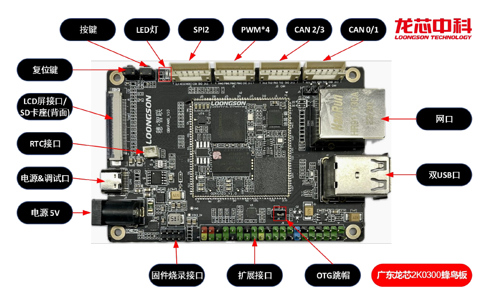
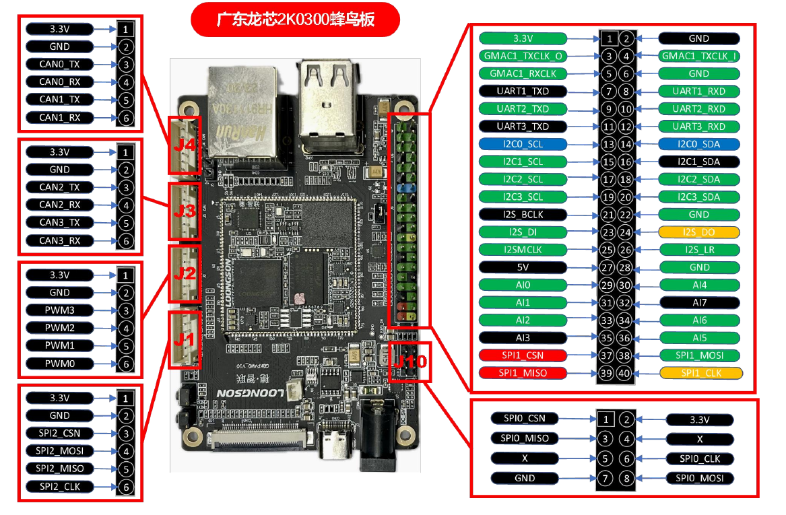
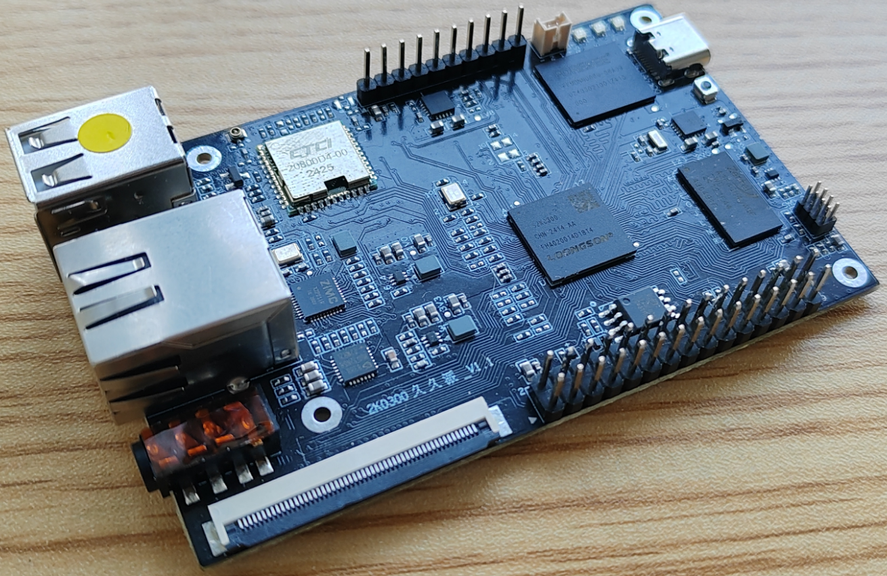
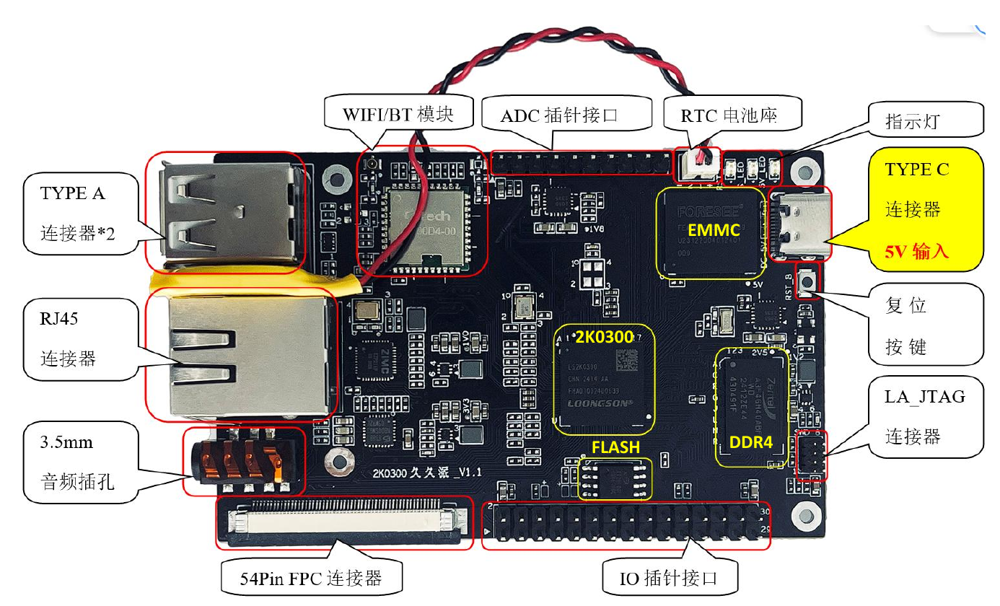
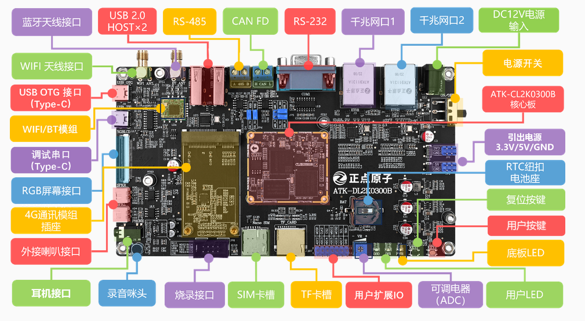
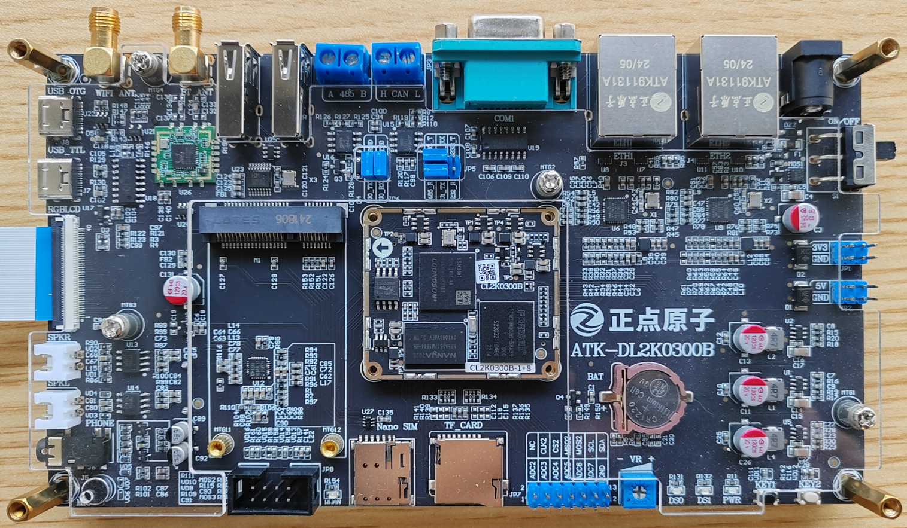
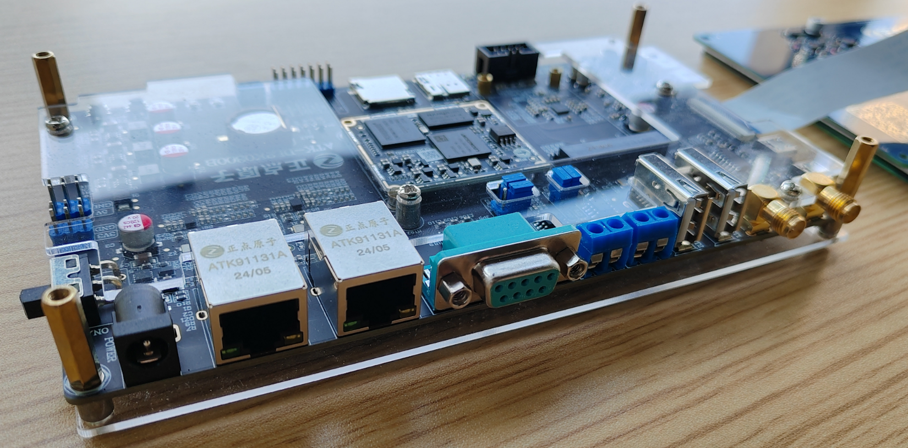
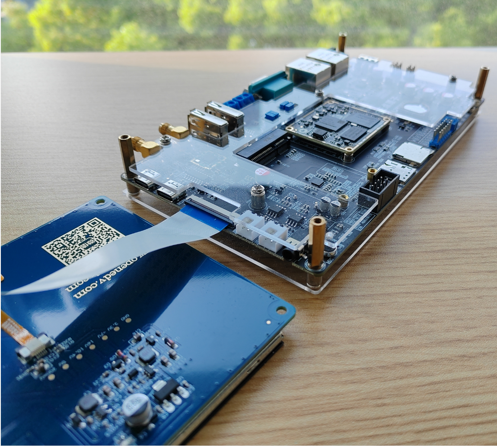

# 主机系列

## 3A6000NUC(101001)

| 编号 | 库存量 | 常用称呼(型号)   | 存储配置       | 基准价值  | 备注 |
| :----- | :----- | :--------- | :------------ | :------ | :--- |
| 101001 | 4 | 中科云3A6000NUC(`CTCI02LS3A6000C-NUC`) | 16GB(DDR4)+256GB(SSD)| 预估:2799 | 双网卡/7A2000核显 |

* 接口:
    * 电源: 19V*6.32A(120.08W)
    * 外露功能接口
        * 前 -> [USB3.0*2, Type-C*1]
        * 后 -> [USB2.0*4, HDMI*2, 千兆网口RJ45*2, 3.5mm音频接口*1]
* 自带配件: (无指定情况数量默认为1个或1袋)
    * HDMI线材, 电源, 支架, 备用螺丝, 硬盘线, 说明书, 挡板, 原装盒

## 3A6000台式机(101002)

| 编号 | 库存量 | 常用称呼(型号)   | 存储配置       | 基准价值  | 备注 |
| :----- | :----- | :--------- | :------------ | :------ | :--- |
| 101002 | 2 | 龙芯3A6000台式机-PS2(`XA61200_V1.1`) | 16GB(DDR4)+256GB(SSD)  | UEFI(EDK2)| 龙芯官方的标准台式机 |

# 板卡系列

## 3A6000双网卡(701001)

| 编号 | 库存量 | 常用称呼(型号)   | 存储配置       | 基准价值  | 备注 |
| :----- | :----- | :--------- | :------------ | :------ | :--- |
| 701001 | 0 | 3A6000ECC校验双网卡板卡(`XA61201_V1.0`) | 无存储 | 无 | DTX版型板卡 |

## 3C6000单路(701002)

| 编号 | 库存量 | 常用称呼(型号)   | 存储配置       | 基准价值  | 备注 |
| :----- | :----- | :--------- | :------------ | :------ | :--- |
| 701002 |  5 | 3C6000单路板卡(`QC622D0_V1.0/V1.1`) | 无存储 | 预计:5400 | 近期入库                 |

## 2K300蜂鸟(652001)

| 编号 | 库存量 | 常用称呼(型号)   | 存储配置       | 基准价值  | 备注 |
| :----- | :----- | :--------- | :------------ | :------ | :--- |
| 652001 | 30   | 2K0300蜂鸟版(`GBKPAW0_V1.0/G2K03Z0_V1.0`) | 512MB板载内存+4GB eMMC | 预计:399 | 固件系统完全开源 |

* 资料: [Gitee / open-loongarch / docs-2k0300](https://gitee.com/open-loongarch/docs-2k0300)

* 接口：
    * 电源: 5V直流电源供电(可使用DC6D-005A电源插座或使用Type-c接口直接供电)
    * 4\* CAN 接口, 4\* PWM 接口, 3\* SPI 接口, 1\* LCD触摸屏, 8\* AD 模拟输入接口, 4\* I2C 接口, 1\* I2S 接口, 4\* UART 接口, 2\* USB2.0 接口(其中一路支持 OTG)

* 自带配件：
   * Type-c数据线
   * 纽扣电池

## 2K0300久久派(652002)

| 编号 | 库存量 | 常用称呼(型号)   | 存储配置       | 基准价值  | 备注 |
| :----- | :----- | :--------- | :------------ | :------ | :--- |
| 652002 | 3 | 2K0300久久派WIFI | 512MB板载内存+4GB eMMC | 预计:109 | 此为WIFI板 |

* 接口：
    * 电源: 5V直流电源供电(可使用DC6D-005A电源插座或使用Type-c接口直接供电)
    * 资料: [中科云论坛 / 龙芯久久派资料汇集](https://bbs.ctcisz.com/forum.php?mod=viewthread&tid=2)
    * 1\* 千兆网口, 2\* USB2.0接口, 1\* LCD触摸屏, 1\* WIFI/BT模组(支持单天线), 8\* ADC(12bit), 2\* SPI(1路可支持slave,可复用为PWM), 2\* I2C(复用GPIO), 3\* UART(复用GPIO), 2\* CAN(复用GPIO), 2\* PWN(复用GPIO)

## 2K300正点(652003)

| 编号 | 库存量 | 常用称呼(型号) | 存储配置 | 基准价值 | 备注 |
| :----- | :----- | :--------- | :------------ | :------ | :--- |
| 652003 | 15 | 正点原子2K0300(`ATK-DL2K0300B`) | 1G板载内存+8G eMMC | 预计:766 | 自带七寸触摸屏幕 |

* 资料: [正点原子官方WIKI/ATK-DL2K0300](https://wiki.alientek.com/docs/category/atk-dl2k0300/)

* 接口: 如下图
    * 

# 虚拟机系列

> 备注:  
> * 社区带宽较低(专线50Mbp), 请勿申请社区虚拟机后用于大带宽业务  
> * 虚拟机推荐使用安同系统, 安同源有内网镜像, 默认提供安同的服务器模式  2

## 3C5000四路-单机

| 编号 | 库存量 | 常用称呼(型号) | 存储配置 | 基准价值 | 备注 |
| :----- | :----- | :--------- | :------------ | :------ | :--- |
| 400001 | 1 | 社区-6号机(PVE6) | 256 DDR4 + 256 SSD*2 / 480 SSD / 8T RAID5 | 无 | 建议一些对CPU性能要求不高的,比如WEB服务 |

## [未上线] 3C6000单路-集群*5

| 编号 | 库存量 | 常用称呼(型号) | 存储配置 | 基准价值 | 备注 |
| :----- | :----- | :--------- | :------------ | :------ | :--- |
| 401001 | 5 | 社区主集群 | 256 DDR4 + 256 SSD / 4T HHD*4(带Raid卡) | 预计: 2万 | 受制于KVM问题(虚拟机会有崩溃现象), 社区主集群并未正式上线, 如有特殊需求可已物理机形式远程借用, 但在KVM修复后会收回使用权限! |