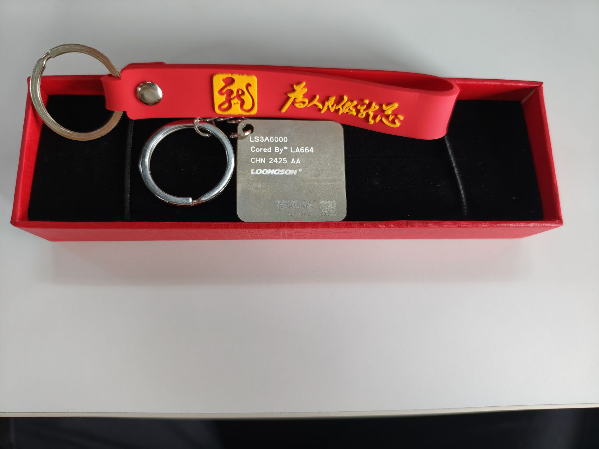

# 存储类

例: 内存, 硬盘(机械硬盘HDD, 固态硬盘SSD), U盘

# 接口类

例: TTL 模块, JTAG烧录器, 232/485串口线, 电源

# 电子类

例: 例: TTL 模块, JTAG烧录器, 232/485串口线, 电源

# 书记与实物奖励类

例: 龙芯的足迹, 计算机体系接口(龙芯版本), CPU设计实践(LoongArch版本), 龙芯纪念徽章, 衬衫, 卫衣, 贴纸

## 3A6000芯片钥匙扣

更新日期: 2025-4-7

| 编号 | 捐赠厂商     | 先存量 | 历史存量 | 价值   | 备注                  |
| ---- | ------------ | ------ | -------- | ------ | --------------------- |
| 50001| 001-龙芯中科 | 300      | 300        | 非卖品 | 3A6000芯片钥匙扣 |

## 龙芯的足迹

更新日期: 2024-11-25

| 编号 | 捐赠厂商     | 先存量 | 历史存量 | 价值   | 备注                  |
| ---- | ------------ | ------ | -------- | ------ | --------------------- |
| 50001| 001-龙芯中科 | 0      | 0        | 非卖品 | 限定版(签名:  胡伟武) | 

