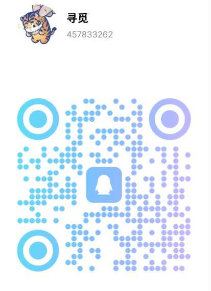

# 板卡捐赠说明

龙芯爱好者社区接受个人、组织捐赠，旨在丰富漂流板库存，为更多有需要的爱好者提供支持，接受捐赠的物品为：龙架构（LoongArch64）主机、板卡以及其板卡配件。捐赠接受没有原包装或存在不影响正常使用的缺陷（如个别 USB 接口无法使用、缺少 ABI 2.0 固件支持等），捐赠的设备将会用于以下用途：

* 龙芯爱好者社区使用（可能会用于验证测试或临时办公等用途）
* 加入板卡漂流计划，为有需要的爱好者提供所需设备
* 参与活动赠送，免费赠送给符合社区贡献要求的贡献者

参与捐赠即代表您接受如上用途和如下条款：

1. **自愿原则**：所有捐赠均为自愿行为
2. **免责条款**：对于不可抗力因素造成的损失，本组织不承担法律责任
3. **信息使用声明**：我们会将您的捐赠者信息公开在板卡漂流计划中，不过您有权要求我们移除您的捐赠记录或对您捐赠的行为进行保密；您的捐赠者信息将仅在必要范围内使用，以确保捐赠流程的顺利进行及后续联系

具体展示信息的样例如下：

称呼 | 邮箱 | 主页 | 捐赠物品
-- | -- | -- | --
昵称/组织/公司名称 | 非必填 | 非必填 | 3A6000 板卡、整机等（收到捐赠物品后由社区管理员填写）
   
> 如对捐赠过程有任何疑问或争议，请首先尝试与我们联系或提交工单 (issue) 进行交流。

## 捐赠流程

在捐赠前，请确保您捐赠的设备可以正常开机使用。

捐赠人可通过如下方式发送捐赠物品信息并表达捐赠意愿，捐赠物品需使用顺丰，可选择到付：

1. 本仓库的工单 (issue) 系统
2. 向 [loongarch@whlug.cn](mailto:loongarch@whlug.cn) 发送邮件
3. 扫描下方二维码，通过 QQ 或微信联系捐赠

### 捐赠信息

推荐使用如下示例填写捐赠物品的标题（括号内的内容如不清楚可以暂不填写）：

* \[物品捐赠\] 捐赠一台 3A6000 主机（主板型号：XA61201_V1.0，配置：16GiB 内存/512GB SSD）
* \[物品捐赠\] 捐赠一张 3A6000 板卡（板卡型号：XA61201_V1.0，特点：双网口、ECC 内存）

正文格式:

- 称呼：昵称、组织名或公司名称（用于在捐赠页面对外展示）
- 邮箱：非必填
- 主页：非必填（可以个人博客/主页、Git 仓库、公司主页或其他您想展示的、合规合法的链接）
- 捐赠物品: 尽可能详细第填写捐赠物品信息
- 备注: 非必填 (为了便于后期漂流板用户借用后获取相关信息的内容；您如果有主机、板卡手册获取其他资料获取链接，可以写在备注处)

> 如果您希望匿名捐赠，可以不填写上述“称呼”、“邮箱”及“主页”三处信息。

### 捐赠确认

完成捐赠后，我们将向您发送一封电子邮件作为捐赠凭证；若需其他材料，请在捐赠备注中注明。
